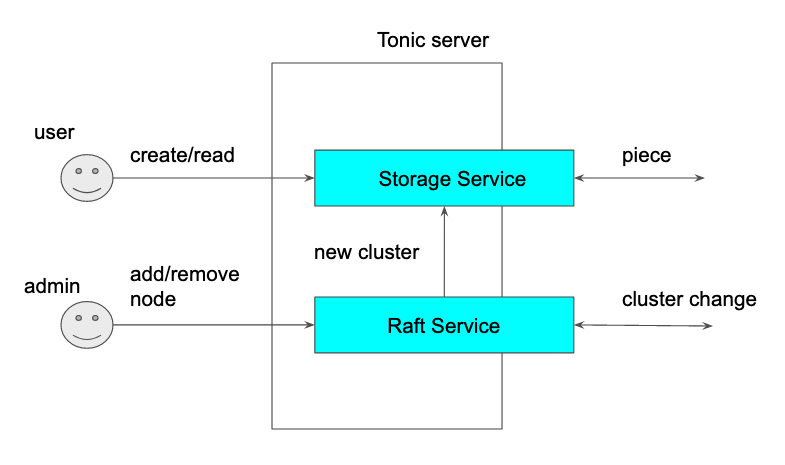

# Architecture

Sorock implements the server using [Tonic](https://github.com/hyperium/tonic) so
all external communication is done by gRPC.

Tonic allows to stack gRPC services in the server.

Sorock uses Raft consensus algorithm to replicate the cluster change
because all nodes have to at least eventually see the same cluster state and replication should be quick enough. Some other system uses gossip protocol to disseminate the cluster change but using Raft it will be more quicker.

Raft service builds the [ASURA](https://github.com/akiradeveloper/ASURA) data structure based on cluster changes and then it is passed to Storage service.

Storage service is responsible for handling user requests but lot of p2p communications are executed in the cluster. When the cluster is changed, it tries to move the erasure-coded pieces to the appropriate nodes and rebuild a piece if it is lost.

